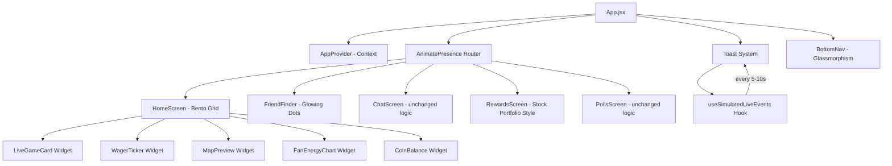

# CalPlay UI Overhaul — "Series-A Ready" Plan

## Executive Summary
Transform CalPlay from a functional prototype into a **premium, VC-demo-ready** product inspired by the **Tesla App** (dark, data-dense bento grid) and **Whoop** (fluid data visualization, real-time feel).

**Brand: UC Berkeley / Cal Bears Football**

**Core principles:** OLED dark mode, glassmorphism, micro-interactions, simulated live data.

---

## REBRAND: Stanford → Cal / UC Berkeley

| Element | Old (Stanford) | New (Cal / Berkeley) |
|---|---|---|
| App Name | Cardinal Play | **CalPlay** |
| Logo Text | CP (Cardinal Play) | CP (CalPlay) |
| Primary Color | Cardinal Red #8C1515 | **Cal Blue #003262** |
| Neon Accent | Red #E30000→#FF4D4D | **Cal Gold #FDB515→#FFD54F** |
| Secondary Accent | Gold #D4AF37 | **Berkeley Blue #1A73E8** |
| Coins | Cardinal Coins | **Bear Coins** |
| Mascot | Stanford Tree SVG | **Cal Bear** (simplified SVG or emoji 🐻) |
| Opponent | Stanford vs. Cal | **Cal vs. Stanford** |
| Stadium | Stanford Stadium | **California Memorial Stadium** |
| User Email | stanford.edu | **berkeley.edu** |
| End Zones | STANFORD | **CALIFORNIA** |
| Student Section | Stanford student section | **Cal student section** |
| Gradient | Red gradient | **Blue-to-gold gradient** |

---

## Current State

| Aspect | Current | Target |
|---|---|---|
| Background | `#0A0A0A` | `#050505` (true OLED black) |
| Card surface | `rgba(255,255,255,0.04)` | `#121212` with `#333333` border |
| Accent | `#8C1515` / `#B83A3A` | `#FDB515` → `#FFD54F` neon Cal Gold |
| Font | System SF Pro stack | Inter (loaded via Google Fonts) |
| Tracking | Default | Tighter `-0.02em` to `-0.04em` |
| Charts | None | Recharts AreaChart with gradient |
| Live feel | Static mock data | Simulated real-time toasts + ticker |

---

## Architecture Diagram



## File Structure (New & Modified)

```
src/
├── index.css                    ← MODIFIED: @theme OLED palette + typography
├── App.jsx                      ← MODIFIED: Toast system integration
├── App.css                      ← MODIFIED: Clean up boilerplate
├── components/
│   ├── BottomNav.jsx            ← MODIFIED: Enhanced glassmorphism
│   ├── CardinalCoin.jsx         ← UNCHANGED
│   ├── StanfordTreeChibi.jsx    ← UNCHANGED
│   ├── FanEnergyChart.jsx       ← NEW: Recharts AreaChart
│   ├── WagerTicker.jsx          ← NEW: Scrolling bet ticker
│   └── ui/
│       ├── Card.jsx             ← NEW: Premium surface card
│       ├── Badge.jsx            ← NEW: LIVE badge, status badges
│       ├── Button.jsx           ← NEW: Tactile button with active:scale-95
│       ├── Dialog.jsx           ← NEW: Apple Wallet popup
│       ├── AnimatedNumber.jsx   ← NEW: Framer Motion number counter
│       └── Toast.jsx            ← NEW: Floating notification system
├── hooks/
│   └── useSimulatedLiveEvents.js ← NEW: Random live event generator
├── context/
│   └── AppContext.jsx           ← UNCHANGED
└── pages/
    ├── HomeScreen.jsx           ← MODIFIED: Bento Grid dashboard
    ├── FriendFinder.jsx         ← MODIFIED: Glowing dot markers
    ├── RewardsScreen.jsx        ← MODIFIED: Stock portfolio leaderboard + Apple Wallet redeem
    ├── ChatScreen.jsx           ← MINIMAL CHANGES: color token updates only
    ├── PollsScreen.jsx          ← MINIMAL CHANGES: color token updates only
    ├── AuthScreen.jsx           ← MINIMAL CHANGES: background color update
    └── SplashScreen.jsx         ← MINIMAL CHANGES: background color update
```

---

## PHASE 1: Visual Foundation

### 1A. Install Dependencies
```bash
npm install recharts
```
No Shadcn/UI CLI — we build lightweight custom UI components that match the aesthetic. This avoids Tailwind v4 compatibility issues and keeps the bundle lean for a prototype.

### 1B. Add Inter Font
Add to `index.html`:
```html
<link rel="preconnect" href="https://fonts.googleapis.com">
<link rel="preconnect" href="https://fonts.gstatic.com" crossorigin>
<link href="https://fonts.googleapis.com/css2?family=Inter:wght@400;500;600;700;800;900&display=swap" rel="stylesheet">
```

### 1C. Update Color Palette in `src/index.css`
Replace `@theme {}` block with OLED dark mode tokens:

```css
@theme {
  /* Background layers */
  --color-bg-primary: #050505;
  --color-bg-surface: #121212;
  --color-bg-elevated: #1A1A1A;

  /* Borders */
  --color-border-subtle: #1F1F1F;
  --color-border-default: #333333;

  /* Accent — Neon Cardinal Red */
  --color-cardinal: #E30000;
  --color-cardinal-dark: #B00000;
  --color-cardinal-light: #FF4D4D;

  /* Legacy reds kept for compatibility */
  --color-cardinal-muted: #8C1515;
  --color-cardinal-soft: #B83A3A;

  /* Gold accent */
  --color-gold: #D4AF37;
  --color-gold-light: #F5D76E;

  /* Text */
  --color-text-primary: #FFFFFF;
  --color-text-secondary: #A1A1AA;
  --color-text-muted: #52525B;

  /* Status */
  --color-success: #4ADE80;
  --color-info: #60A5FA;
}
```

### 1D. Update Typography
```css
body {
  font-family: 'Inter', -apple-system, BlinkMacSystemFont, 'SF Pro Display', sans-serif;
  letter-spacing: -0.02em;
}
```

Update root backgrounds from `#0A0A0A` → `#050505` in:
- `src/index.css` (html, body, #root)
- `src/App.jsx` (inline style on wrapper div)

---

## PHASE 2: Component Library

### 2A. Card Component
A reusable surface card with `#121212` background, `#333333` border, 16px radius.
Supports `variant` prop: `default`, `gradient` (for the live game card), `glass`.

### 2B. Badge Component  
Renders status badges. Key variant: pulsing `LIVE` badge with green dot animation.

### 2C. Button Component
Wraps `motion.button` with built-in `active:scale-95` and `whileTap` animation.
Variants: `primary` (neon red gradient), `secondary` (glass), `ghost`.

### 2D. Dialog Component
Full-screen overlay with spring animation. Used for the Apple Wallet-style redeem confirmation.
Design: rounded 28px card, frosted border, centered emoji, QR-code-like pattern at bottom.

### 2E. AnimatedNumber Component
Uses Framer Motion `useMotionValue` + `useTransform` + `animate` to smoothly tween between number values. Used for coin counters and leaderboard scores.

### 2F. Toast Component
Floating notification that slides in from the top. Auto-dismisses after 4 seconds.
Supports types: `bet` (gold accent), `message` (blue accent), `alert` (red accent).
Managed via a `ToastProvider` context wrapping the app.

---

## PHASE 3: Feature Components

### 3A. FanEnergyChart
```
┌─────────────────────────────────┐
│  FAN ENERGY                LIVE │
│  ▓▓▓▓▓▓▓▓▓▓▓▓▓▓▓▓▓▓▓▓▓▓▓▓▓▓▓ │
│  ▓▓▓▓▓▓▓▓▓▓▓░░░░░░░▓▓▓▓▓▓▓▓▓ │
│  ▓▓▓▓▓▓▓░░░░░░░░░░░░░░▓▓▓▓▓▓ │
│  ░░░░░░░░░░░░░░░░░░░░░░░░░░░░ │
│  Q1      Q2      Q3     NOW    │
└─────────────────────────────────┘
```
- Recharts `AreaChart` with a `linearGradient` fill from `#E30000` to transparent.
- Stroke color: `#FF4D4D`.
- `useEffect` interval every 2 seconds pushes a new random data point (simulating live decibel/hype levels).
- X-axis shows time, Y-axis hidden for minimal look.
- Dark grid lines at `#1F1F1F`.

### 3B. WagerTicker
A horizontally auto-scrolling marquee showing recent bets:
```
🔥 Jordan bet 250 on "Touchdown" · Karis bet 100 on "Under 150 yds" · ...
```
- CSS `@keyframes` marquee animation with `translateX`.
- Generates random fake bets from the friends list every few seconds.

### 3C. useSimulatedLiveEvents Hook
```js
// Returns nothing — pushes toasts into the ToastProvider context
// Every 5-10 seconds, randomly fires one of:
//   - "🔥 Mahi just placed a 500 coin wager!"
//   - "💬 New message in Stadium Chat"
//   - "🏈 TOUCHDOWN! Stanford scores!"
//   - "📈 Fan Energy just hit 95%!"
```

---

## PHASE 4: Page Overhauls

### 4A. HomeScreen Bento Grid

```
┌─────────────────────────────────┐
│  Hey, Aarnav 👋                 │
│                                 │
│ ┌─────────────────────────────┐ │
│ │ 🔴 LIVE                     │ │
│ │ STANFORD vs. CAL            │ │
│ │ Q3 · 8:42        24 – 17   │ │
│ └─────────────────────────────┘ │
│                                 │
│ ┌──────────┐ ┌──────────────┐   │
│ │ 💰 2,450 │ │ 📍 In Stadium│   │
│ │ Coins    │ │    · 5×      │   │
│ └──────────┘ └──────────────┘   │
│                                 │
│ ┌─────────────────────────────┐ │
│ │  FAN ENERGY          🔴LIVE │ │
│ │  ~~~~~~~~ area chart ~~~~~~ │ │
│ └─────────────────────────────┘ │
│                                 │
│ ┌─────────────────────────────┐ │
│ │ 🔥 Recent Wagers  ← ticker │ │
│ └─────────────────────────────┘ │
│                                 │
│ ┌──────────┐ ┌──────────────┐   │
│ │ 📍 Map   │ │ 💬 Chat      │   │
│ │ 8 Active │ │ 24 messages  │   │
│ └──────────┘ └──────────────┘   │
│                                 │
│ ┌──────────┐ ┌──────────────┐   │
│ │ 🏆Rewards│ │ 📊 Wagers    │   │
│ │ New live │ │ 4 active     │   │
│ └──────────┘ └──────────────┘   │
└─────────────────────────────────┘
```

- Full-width cards use `grid-column: span 2`.
- Feature grid cards use `grid-template-columns: 1fr 1fr`.
- All cards use the new `Card` component.
- Live game card has neon red gradient border glow.
- Map preview shows a tiny version of the stadium SVG with dot count.

### 4B. BottomNav Glassmorphism
Update from current `rgba(10,10,10,0.92)` to:
```css
background: rgba(5,5,5,0.80);
backdrop-filter: blur(20px);
border-top: 1px solid rgba(255,255,255,0.06);
```
Active icon color changes from `#B83A3A` → `#FF4D4D` (neon red).
Active pip gradient uses the new `#E30000` → `#FF4D4D`.

### 4C. Leaderboard — Stock Portfolio Style
- Top section: Big animated coin count with `AnimatedNumber`.
- Rank change indicator: ↑2 (green) or ↓1 (red) next to each name.
- Mini sparkline chart next to each user showing their coin history trend.
- Keep the existing podium but update colors to neon palette.

### 4D. Redeem Popup — Apple Wallet Card
```
┌─────────────────────────┐
│   ░░░░░░░░░░░░░░░░░░░   │  ← frosted glass top
│                         │
│         🌮              │  ← big emoji
│   Free Nachos & Drink   │
│   REDEEMED ✓            │
│                         │
│   ╔═══════════════╗     │  ← simulated barcode
│   ║ ||||| ||| ||  ║     │
│   ╚═══════════════╝     │
│                         │
│   Valid until 11:59 PM  │
│   Stanford Stadium      │
└─────────────────────────┘
```

### 4E. FriendFinder — Glowing Dots
Replace the current avatar circles with:
- Colored glowing dots (8px circle + animated glow ring in avatar's color).
- On tap, expand to show name tooltip.
- The "YOU" marker keeps its existing pulse animation but uses neon red.

### 4F. Toast + Live Events Integration
- Wrap `App` content in a `ToastProvider`.
- Call `useSimulatedLiveEvents()` inside `AppContent`.
- Toasts render in a fixed container at top of screen.

### 4G. Clean Up
- Delete boilerplate CSS in `App.css`.
- Remove unused `react.svg` and `vite.svg` if not needed.

---

## Dependency Changes

| Package | Action | Purpose |
|---|---|---|
| `recharts` | Install | FanEnergyChart area graph |

No other new dependencies. We hand-build the UI components to avoid Shadcn/Tailwind v4 compatibility friction and keep the prototype lightweight.

---

## Risk Mitigations

1. **Tailwind v4 compatibility**: All color tokens go into `@theme {}` in CSS, not a JS config file.
2. **No functionality removal**: Every existing feature is preserved. Only the visual layer changes.
3. **Inline styles → Tailwind migration**: Done incrementally. Pages that work fine with inline styles keep them; new components use Tailwind classes.
4. **Simulated data**: All "live" data uses `setInterval` + random generators — no backend needed.

---

## Execution Order (Optimized)

1. Install recharts + add Inter font
2. Update `index.css` with OLED palette and typography
3. Build the 6 ui/ components (Card, Badge, Button, Dialog, AnimatedNumber, Toast)
4. Build FanEnergyChart + WagerTicker + useSimulatedLiveEvents
5. Refactor HomeScreen into Bento Grid
6. Update BottomNav glassmorphism
7. Update RewardsScreen (leaderboard + redeem popup)
8. Update FriendFinder markers
9. Integrate Toast system into App.jsx
10. Clean up + final polish
